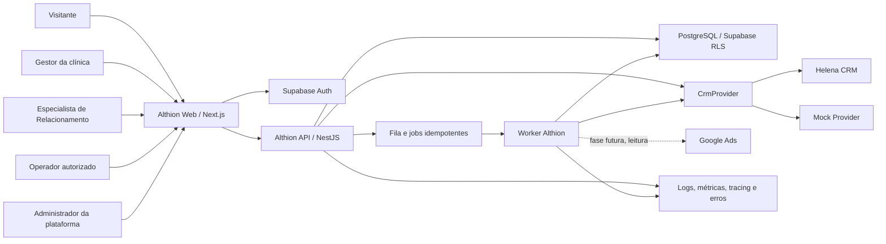
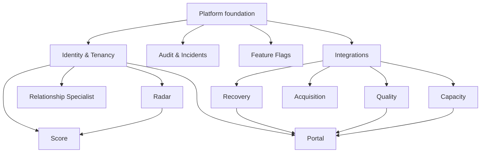
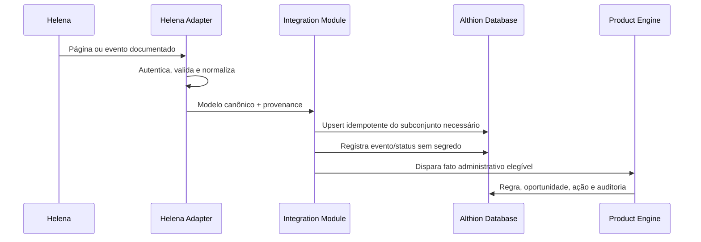

# Arquitetura proposta

## Status

Este documento combina arquitetura implementada e arquitetura-alvo. A Fundação foi materializada na Fase 1; módulos de produto, worker, filas e integrações reais continuam condicionados à aprovação das fases correspondentes.

## Direção arquitetural

A base recomendada é um monorepo TypeScript com frontend Next.js e uma API NestJS organizada como **modular monolith**. O PostgreSQL/Supabase concentra dados transacionais, autenticação e RLS. Processamento assíncrono entra apenas quando houver casos reais de sincronização, regras ou relatórios.

Essa abordagem preserva fronteiras de domínio sem antecipar microserviços, reduz custo operacional no início e mantém caminhos claros para extrair workers ou módulos quando carga, isolamento ou equipes justificarem.

## Mapa de contexto



## Contêineres lógicos

| Contêiner           | Responsabilidade                                                                        | Não deve fazer                                                              |
| ------------------- | --------------------------------------------------------------------------------------- | --------------------------------------------------------------------------- |
| Web                 | Renderização, navegação, formulários, acessibilidade e estados de UX                    | Autorizar sozinho, conter service role ou regra de negócio crítica          |
| API                 | Autenticação do request, casos de uso, políticas, validação, auditoria e contratos REST | Importar DTO da Helena para o domínio ou contornar RLS                      |
| Worker              | Sincronizações, regras, relatórios e tarefas assíncronas idempotentes                   | Executar sem `organization_id`, idempotency key ou trilha de auditoria      |
| PostgreSQL/Supabase | Estado transacional, constraints, RLS, histórico e agregações necessárias               | Virar réplica integral da Helena ou repositório clínico                     |
| Provider adapters   | Traduzir capacidades externas para modelos canônicos Althion                            | Propagar nomes, enums ou paginação do fornecedor para os módulos de produto |

## Estrutura proposta do repositório

```text
apps/
  web/                 # Next.js App Router
  api/                 # NestJS modular monolith
  worker/              # criado quando a primeira fase assíncrona exigir
packages/
  contracts/           # DTOs REST e schemas Zod compartilháveis
  domain/              # tipos/valores canônicos sem dependência de framework
  ui/                  # componentes acessíveis e tokens da Althion
  config/              # presets TypeScript, lint e variáveis tipadas
  testing/             # builders e fixtures sintéticas
supabase/
  migrations/          # SQL versionado, incluindo RLS e grants
  seed.sql              # somente dados sintéticos locais
  tests/                # testes SQL/RLS
docs/
  architecture/
  product/
  security/
  data/
```

`apps/worker` não precisa ser criado vazio na Fundação; a fronteira já fica reservada e entra quando Recovery ou sincronização tiver job real.

## Módulos da API



Cada módulo expõe casos de uso e contratos; acesso a tabelas de outro módulo ocorre por serviço público do módulo ou por projeção de leitura documentada. Controllers não acessam banco diretamente.

## Autenticação e fluxo de autorização

1. Supabase Auth autentica o usuário.
2. O navegador recebe apenas configuração pública e token de sessão; nunca a service role.
3. A API valida assinatura, emissor, audiência e expiração do JWT.
4. A API resolve o principal e memberships ativas; o `organization_id` solicitado deve estar autorizado.
5. O caso de uso aplica RBAC e escopo de clínica/unidade/fila.
6. A consulta é executada com contexto do usuário para que RLS aplique isolamento novamente.
7. Operações relevantes geram auditoria sem conteúdo sensível desnecessário.

Redirecionamentos do Next.js melhoram UX, mas não são uma fronteira de segurança. API, banco, storage e jobs aplicam controles próprios.

## Estratégia de acesso a dados

- Requests de usuário usam cliente Supabase no servidor com o JWT daquele usuário, preservando RLS.
- Operações multi-etapa críticas usam funções SQL/RPC pequenas, versionadas, com verificação de membership e tenant.
- Service role é exclusiva de processos server-side privilegiados, armazenada no cofre do ambiente e proibida no bundle web.
- Todo job privilegiado carrega `organization_id`, propósito, autor/origem e idempotency key; repositories exigem tenant explicitamente.
- Tabelas tenant-owned têm `organization_id NOT NULL`, foreign keys compostas quando necessário e RLS deny-by-default.
- A camada de aplicação não substitui constraints do banco; ambos se complementam.

## Estratégia multi-tenant

O particionamento inicial é lógico, em schema compartilhado, com `organization_id`. `clinics`, `units` e escopos adicionais refinam autorização, mas nunca substituem o tenant.

Regras essenciais:

- `profiles` representa a identidade global; `memberships` concede papéis e escopos por organização.
- Especialistas só enxergam organizações/clínicas com assignment ativo.
- Operadores recebem escopos explícitos; o mapeamento de filas externas depende da Helena.
- `viewer` tem apenas leitura.
- revogação ou expiração de membership invalida acesso imediatamente no banco;
- platform admin usa fluxo administrativo separado, MFA obrigatório e auditoria reforçada;
- nenhuma policy aceita `organization_id` fornecido sem conferir membership/assignment.

## Fluxo canônico de integração



Até a entrega da documentação Helena, apenas o contrato e o mock podem operar. O `HelenaCrmProvider` deve falhar de forma explícita como não configurado, sem endpoints fictícios.

## Consistência, eventos e jobs

- REST síncrono para operações do usuário inicialmente.
- Transactional outbox quando uma alteração local precisar produzir trabalho assíncrono confiável.
- At-least-once na fila; consumidores obrigatoriamente idempotentes.
- Chave única por provedor, tenant, tipo e ID/evento externo.
- Retry exponencial com jitter somente para erros transitórios.
- Dead letter com alerta e reprocessamento auditado.
- Estados de sync explícitos; não esconder atraso ou falha como dado atual.

## Observabilidade

- logs JSON com correlation ID, actor, tenant, módulo, ação e resultado;
- redaction central de tokens, segredos, conteúdo de mensagens e campos pessoais;
- métricas de latência, erro, fila, retries, sync lag, regra e webhook;
- tracing entre API, worker e integrações quando houver fluxo distribuído;
- painel de saúde com dependências e freshness dos dados;
- error tracking com ambiente, release e contexto sanitizado;
- auditoria de negócio separada de log técnico.

## Ambientes e entrega

Ambientes mínimos: local, staging e production, com projetos Supabase, credenciais, buckets e chaves separados. Produção exige aprovação após pipeline. Preview não deve copiar dados reais.

Pipeline proposto:

```text
secret scan -> install imutável -> lint -> typecheck -> unit -> integration/RLS
-> build -> E2E relevante -> migration dry-run -> deploy staging
-> smoke/accessibility -> aprovação -> production
```

## Decisões adiadas deliberadamente

- provedor de hospedagem do web/API/worker;
- fila gerenciada e scheduler;
- fornecedor de error tracking e tracing;
- biblioteca de gráficos após protótipo do dashboard;
- armazenamento temporário de conteúdo necessário ao Quality Engine;
- mecanismo de agenda e fonte oficial dos eventos de comparecimento;
- extração de qualquer módulo para microserviço.

## Mapas relacionados

- [Mapa de rotas](./route-map.md)
- [Modelo de dados](./data-model.md)
- [Integrações](./integrations.md)
- [Modelo de segurança](../security/security-model.md)
