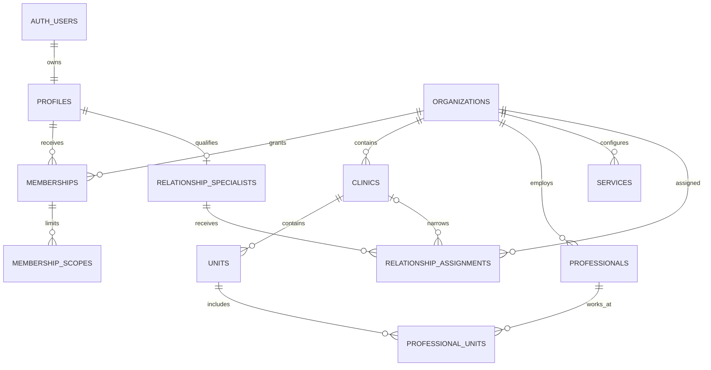
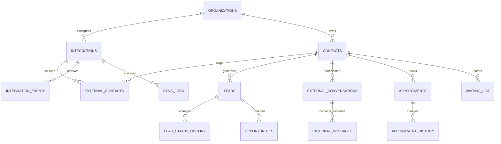
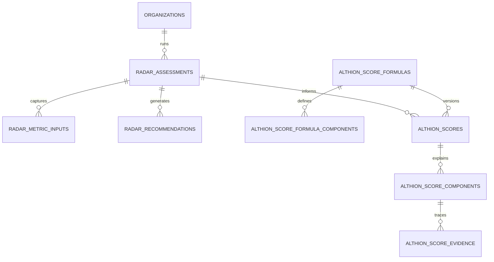
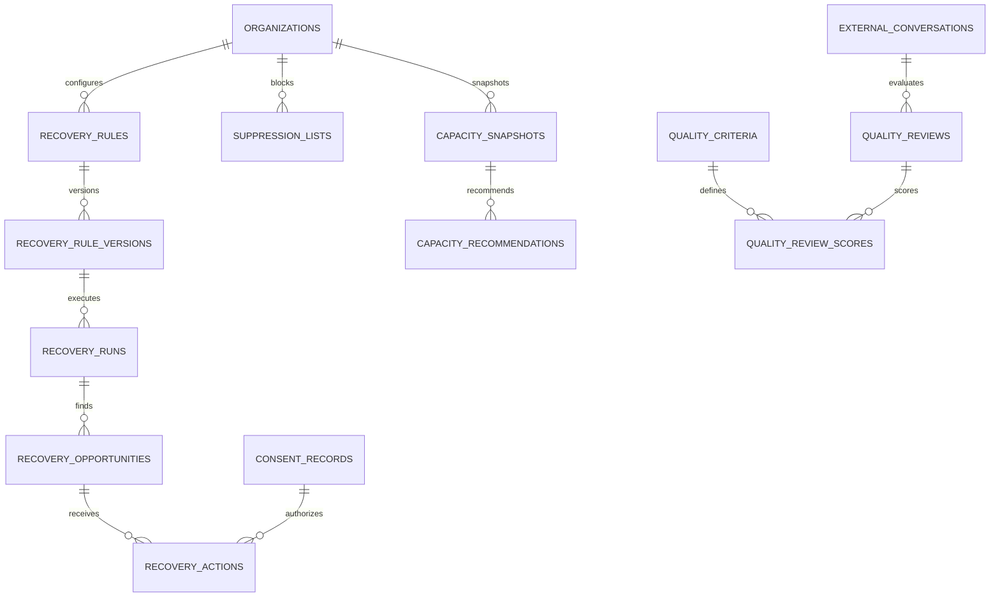
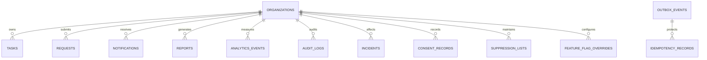

# Modelo inicial de dados

## Status e objetivos

Modelo lógico evolutivo. Tenancy e Fundação foram materializados na Fase 1; Radar e Score foram materializados na Fase 2. Entidades operacionais externas e engines continuam propostas e serão criadas apenas por suas fases.

## Convenções globais

- chaves primárias UUID geradas no banco;
- timestamps em `timestamptz` UTC: `created_at`, `updated_at` e, quando aplicável, `deleted_at`;
- `organization_id NOT NULL` em toda entidade pertencente a cliente;
- foreign keys e constraints compostas asseguram que filhos pertençam ao mesmo tenant;
- índices começam por `organization_id` nas consultas tenant-scoped;
- dinheiro, quando existir futuramente, usa inteiro em centavos e moeda ISO; estimativa é marcada como tal;
- percentuais e scores usam `numeric`, nunca ponto flutuante binário;
- status são enums/check constraints versionados com transições validadas;
- registros históricos, eventos, auditoria e resultados não usam soft delete;
- entidades editáveis podem usar `deleted_at`, sem reutilização silenciosa de identificadores;
- IDs externos são únicos no escopo `(organization_id, integration_id, external_id)`;
- toda derivação guarda fonte, instante observado, versão e evidência suficiente;
- nenhuma tabela contém diagnóstico, prescrição, exame, prontuário ou nota clínica.

## Hierarquia e acesso

`profiles` é global e referencia `auth.users`. Acesso tenant nasce de membership ativa ou assignment ativo. `platform_admin` é concedido por registro administrativo global separado, não por campo editável no perfil.

## Dados operacionais e externos

`external_messages` armazena metadados minimizados, não corpo ou anexo por padrão. `appointments` permanece com source of truth bloqueada; o schema só deve entrar quando origem e semântica forem aprovadas.

## Radar e Score

A fórmula é imutável após ativação. Um novo peso cria nova versão. Cada score registra completude, confiança, período e estado `insufficient_data` quando necessário. Componentes preservam valores e pesos efetivamente usados; evidências apontam para inputs ou snapshots, sem depender do estado atual da fonte.

## Recovery, Quality e Capacity

Regras versionadas são determinísticas no início. A simulação não cria ação externa. Quality começa assistido e persiste resultado/revisão, não o conteúdo clínico. Capacity recomenda antes de automatizar.

## Operação, governança e suporte

`audit_logs` é append-only e separado de logs técnicos. `analytics_events` recebe apenas eventos administrativos minimizados. `outbox_events` e `idempotency_records` suportam entrega at-least-once sem duplicação de efeitos.

## Catálogo de entidades

### Fundação e tenancy

| Entidade                   | Responsabilidade                        | Tenant      |
| -------------------------- | --------------------------------------- | ----------- |
| `organizations`            | Raiz contratual e de isolamento         | É o tenant  |
| `clinics`                  | Clínica pertencente à organização       | Obrigatório |
| `units`                    | Unidade física/operacional              | Obrigatório |
| `profiles`                 | Perfil global ligado ao Auth            | Global      |
| `memberships`              | Papel do perfil na organização          | Obrigatório |
| `membership_scopes`        | Limite por clínica/unidade              | Obrigatório |
| `platform_roles`           | Administração interna privilegiada      | Global      |
| `professionals`            | Profissional para agenda administrativa | Obrigatório |
| `professional_units`       | Vínculo profissional-unidade            | Obrigatório |
| `services`                 | Serviço agendável, sem detalhe clínico  | Obrigatório |
| `relationship_specialists` | Qualificação de perfil interno          | Global      |
| `relationship_assignments` | Carteira autorizada                     | Obrigatório |
| `feature_flags`            | Definição global de flag                | Global      |
| `feature_flag_overrides`   | Rollout por tenant                      | Obrigatório |

### Contatos, leads, agenda e integrações

| Entidade                 | Responsabilidade                          | Observação                                                       |
| ------------------------ | ----------------------------------------- | ---------------------------------------------------------------- |
| `contacts`               | Identidade canônica administrativa mínima | Sem conteúdo clínico; canais diretos não são copiados por padrão |
| `external_contacts`      | Mapeamento de contato por provider        | Mantém external ID e provenance                                  |
| `leads`                  | Lead normalizado                          | Fonte inicial Helena                                             |
| `lead_status_history`    | Histórico append-only                     | Motivo administrativo controlado                                 |
| `external_conversations` | Metadados de conversa                     | Fonte Helena                                                     |
| `external_messages`      | Metadados de mensagem                     | Sem body/anexo por padrão                                        |
| `opportunities`          | Oportunidade CRM canônica                 | Fonte Helena, distinta de recovery                               |
| `appointments`           | Agendamento administrativo                | Fonte oficial ainda indefinida                                   |
| `appointment_history`    | Mudanças de status                        | Append-only                                                      |
| `waiting_list`           | Elegibilidade administrativa              | Sem motivo clínico                                               |
| `integrations`           | Conexão lógica, estado e capabilities     | Segredo fica em cofre, não na tabela em claro                    |
| `integration_events`     | Recebimento/deduplicação sanitizada       | Append-only                                                      |
| `sync_jobs`              | Checkpoint e execução de sync             | Idempotente                                                      |

### Produto e engines

| Entidade                                                       | Responsabilidade                             |
| -------------------------------------------------------------- | -------------------------------------------- |
| `radar_assessments`, `radar_answers`, `radar_recommendations`  | Diagnóstico, inputs e recomendações          |
| `score_formulas`, `score_formula_components`                   | Definição versionada e pesos                 |
| `althion_scores`, `althion_score_components`, `score_evidence` | Resultado, explicação e lineage              |
| `recovery_rules`, `recovery_rule_versions`                     | Identidade da regra e configuração imutável  |
| `recovery_runs`                                                | Simulação/execução e estatísticas            |
| `recovery_opportunities`                                       | Perda elegível e prioridade                  |
| `recovery_actions`                                             | Aprovação, tentativa, execução e resultado   |
| `quality_criteria`                                             | Critérios versionados globais/tenant         |
| `quality_reviews`, `quality_review_scores`                     | Avaliação automática e revisão humana        |
| `capacity_snapshots`                                           | Capacidade agregada por período/profissional |
| `capacity_recommendations`                                     | Recomendação explicável e status             |

### Governança e operação

| Entidade              | Responsabilidade                                           |
| --------------------- | ---------------------------------------------------------- |
| `tasks`               | Pendências internas e do especialista                      |
| `requests`            | Solicitações do cliente e SLA                              |
| `notifications`       | Entrega e leitura de alerta in-app                         |
| `analytics_events`    | Fatos administrativos minimizados para métricas            |
| `reports`             | Metadata, período, versão e arquivo/exportação             |
| `audit_logs`          | Quem fez o quê, quando, onde e com qual resultado          |
| `incidents`           | Segurança/operação, severidade e resposta                  |
| `consent_records`     | Evidência de consentimento quando ele for a base aplicável |
| `suppression_lists`   | Bloqueio de contato por canal/finalidade                   |
| `outbox_events`       | Publicação confiável de eventos locais                     |
| `idempotency_records` | Deduplicação de commands, webhooks e jobs                  |

## Campos transversais de provenance

Não devem ser copiados indiscriminadamente para toda tabela. Entidades externas/derivadas usam o subconjunto aplicável:

| Campo                 | Uso                                                                   |
| --------------------- | --------------------------------------------------------------------- |
| `source_system`       | `helena`, `manual`, `althion`, `google_ads` ou outro valor controlado |
| `source_record_id`    | ID opaco na origem                                                    |
| `source_observed_at`  | Momento a que o fato se refere                                        |
| `source_updated_at`   | Momento reportado pela origem, se confiável                           |
| `synced_at`           | Momento de ingestão                                                   |
| `mapping_version`     | Versão da normalização                                                |
| `source_payload_hash` | Deduplicação/detecção sem payload bruto                               |
| `data_quality_status` | completo, parcial, atrasado, inválido ou desconhecido                 |

## Integridade de tenant

Além de RLS, tabelas filhas usam referências compostas. Exemplo lógico: `units (organization_id, clinic_id)` referencia `clinics (organization_id, id)`. Assim, mesmo uma operação privilegiada não consegue associar acidentalmente registros de organizações distintas.

## Retenção e exclusão

- diretórios como clínica, unidade e profissional: soft delete quando necessário para preservar relações;
- memberships: revogação/expiração, sem apagar a evidência de acesso;
- eventos, históricos, scores, runs, actions e auditoria: append-only com retenção aprovada;
- PII operacional sincronizada: menor janela possível e exclusão propagada conforme contrato;
- anexos: não persistidos por padrão;
- relatórios exportados: TTL e acesso assinado;
- exclusão não pode destruir evidência legal obrigatória; conflitos são documentados e aprovados.

## Índices iniciais

Padrões a materializar por fase, guiados por consulta real:

- `(organization_id, created_at DESC)` para listas e eventos;
- `(organization_id, clinic_id, status)` para operações;
- unique `(organization_id, integration_id, external_id)` para mappings;
- unique de idempotência por tenant e escopo;
- índices parciais para registros ativos (`deleted_at IS NULL`);
- BRIN apenas para tabelas append-only volumosas após medição;
- nenhum índice em conteúdo de mensagem, pois o corpo não será persistido por padrão.

## Decisões bloqueadas

1. Source of truth e semântica de `appointments`/comparecimento.
2. Campos oficialmente disponíveis na Helena e estabilidade de IDs.
3. Necessidade e base legal para qualquer conteúdo temporário usado pelo Quality Engine.
4. Retenção por categoria e contrato.
5. Identificadores necessários para supressão sem reter canal em texto claro.
6. Taxonomia de motivos de perda e estados de lead/agendamento.

O [dicionário de dados](../data/data-dictionary.md) detalha os campos mínimos propostos.
