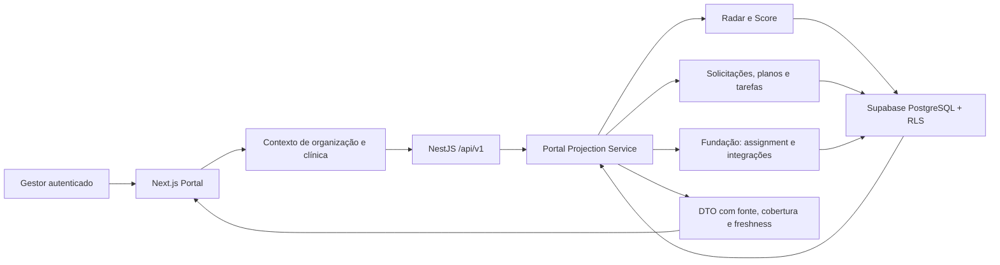

# Plano detalhado da Fase 3 — Portal do Cliente

## Estado e gate

Planejamento iniciado e executado em 16 de julho de 2026 após autorização explícita para avançar continuamente. A implementação foi concluída dentro desta fronteira; o aceite de banco permanece pendente porque Docker/CI não está disponível neste host. Evidências e limitações estão em `docs/releases/phase-3.md`.

A feature flag implementada é `portal.client.v1`, desativada por padrão e habilitada apenas para a organização sintética A no seed até o aceite.

## Objetivo

Transformar a área autenticada em um portal operacional por clínica que responda, nesta ordem:

1. o que precisa de atenção;
2. qual oportunidade administrativa foi identificada;
3. qual é a próxima ação;
4. qual evidência sustenta a recomendação;
5. qual é a cobertura e a atualização dos dados.

O Portal não será um CRM, uma agenda paralela nem uma reconstrução da Helena. Ele agregará apenas dados próprios já confiáveis e deixará fontes ausentes visivelmente indisponíveis.

## Público e decisões provisórias

- audiência primária: `organization_owner` e `clinic_manager`;
- audiência secundária de leitura: `doctor` e `viewer`;
- `relationship_specialist`: acesso somente às organizações ou clínicas com assignment ativo;
- `operator`: sem acesso ao dashboard gerencial ou às mutations do Portal nesta fase;
- contexto principal: uma clínica por vez;
- idioma e locale: `pt-BR`, timezone da clínica;
- dados: exclusivamente sintéticos até os gates de segurança, privacidade e ambiente.

## Escopo funcional

### 1. Shell e contexto do Portal

- seletor autorizado de organização e clínica;
- contexto serializado na URL e revalidado na API/RLS;
- navegação responsiva e orientada por capability;
- indicação de clínica, período, fonte e atualização;
- logout, sessão expirada, acesso negado e troca segura de contexto;
- feature flag verificada no servidor.

O contexto não será confiado a estado do navegador, cookie isolado ou parâmetro sem revalidação.

### 2. Dashboard acionável

O estado inicial deverá funcionar sem interação e apresentar somente blocos disponíveis:

- Score mais recente, cobertura, período e estado de suficiência;
- tendência do Score entre snapshots comparáveis;
- principais dimensões que reduzem a nota;
- recomendações do Radar priorizadas;
- tarefas abertas e vencidas do plano de melhoria;
- solicitações em aberto e respectivos estados;
- Especialista de Relacionamento atribuído;
- saúde e atualização das integrações próprias;
- avisos explícitos para fontes não configuradas, bloqueadas ou desatualizadas.

Os cards serão definidos pela decisão e pela disponibilidade, sem preencher a tela com métricas independentes dentro do mesmo card. Indicadores de detalhe ficam abaixo da visão principal.

### 3. Indicadores

- histórico de Score e cobertura;
- componentes por dimensão;
- valores, numeradores, denominadores e fonte dos inputs Radar;
- comparação somente entre fórmula e períodos compatíveis;
- tabela equivalente para qualquer gráfico;
- exportações já autorizadas na Fase 2 reutilizadas;
- nenhuma projeção financeira apresentada como fato.

### 4. Oportunidades

Nesta fase, “oportunidade” será uma projeção somente leitura de `radar_recommendations`, com `source_type = radar_recommendation` e link para a evidência correspondente.

Não serão criados `recovery_opportunities`, resultados recuperados, contatos automáticos ou ações Helena. A interface deverá distinguir:

- recomendação do Radar;
- tarefa do plano de melhoria;
- oportunidade futura do Recovery Engine.

### 5. Solicitações

- listagem por clínica, status, prioridade e categoria;
- criação idempotente por usuários autorizados;
- detalhe e histórico de transições;
- gestão por owner, manager e Especialista atribuído;
- confirmação de resolução pelo fluxo aprovado;
- limite de texto, aviso para não inserir dados de pacientes ou informações clínicas;
- sem anexos, e-mail automático ou conteúdo processado por IA.

Taxonomia provisória:

```text
category: access | integration | data_quality | operational_support | meeting | other
status: open | acknowledged | in_progress | waiting_customer | resolved | closed
priority: low | normal | high | urgent
```

`urgent` significa urgência operacional da conta, nunca urgência clínica. A interface deverá explicitar essa distinção.

### 6. Plano de melhoria e tarefas

- um plano ativo por clínica;
- versão, período, status e Score de origem opcional;
- tarefas com prioridade, responsável, prazo e estado;
- tarefa opcionalmente originada de recomendação do Radar;
- histórico de transições e auditoria;
- progresso calculado por tarefas concluídas elegíveis;
- nenhuma tarefa clínica ou orientação de tratamento.

Taxonomia provisória:

```text
plan_status: draft | active | completed | archived
task_status: todo | in_progress | blocked | completed | cancelled
task_priority: low | normal | high
```

### 7. Especialista de Relacionamento

- nome do Especialista atribuído;
- escopo e início do assignment;
- estado vazio quando não houver assignment;
- atalho para criar solicitação ou solicitar reunião;
- sem telefone, e-mail pessoal, agenda externa ou alegação de SLA não configurado.

### 8. Relatórios

- catálogo dos relatórios Radar/Score existentes;
- acesso às páginas imprimíveis e CSV auditado;
- agrupamento por clínica e período;
- nenhum arquivo persistido ou nova tabela `reports` até existir necessidade de geração assíncrona/storage.

### 9. Integrações e configurações

- integração: provider, estado, capabilities, última sincronização bem-sucedida e erro sanitizado;
- a integração de dados Helena permanece `disabled` (opcional) sem ação de conexão; a Helena opera em paralelo;
- Mock permanece identificado como ambiente sintético;
- configurações de organização, clínica, timezone e acessos em modo de leitura nesta fase;
- mutations de identidade, retenção, integração e permissões continuam nos fluxos administrativos já autorizados ou em fase própria.

## Fora de escopo

- leads reais, conversas, mensagens ou funis Helena;
- agenda, disponibilidade, confirmação, cancelamento, falta ou comparecimento reais;
- Recovery Engine e automação de contatos;
- Quality Engine, performance de IA ou conteúdo de conversas;
- Capacity Engine;
- notificações por e-mail, WhatsApp, push ou inbox;
- anexos em solicitações;
- geração assíncrona ou armazenamento de PDF;
- edição de integrações e secrets;
- projeção de receita, ROI ou “valor recuperado” sem fonte suficiente;
- dashboards agregados entre clínicas com definições ou períodos incompatíveis;
- qualquer dado ou funcionalidade clínica.

## Fontes oficiais e estados de disponibilidade

| Informação                                 | Fonte nesta fase         | Tratamento no Portal                         |
| ------------------------------------------ | ------------------------ | -------------------------------------------- |
| organização, clínica, papel e escopo       | Fundação Althion         | disponível conforme RLS                      |
| Score, componentes, evidências e cobertura | Althion Score            | disponível ou `insufficient_data`            |
| recomendações e inputs                     | Althion Radar            | disponível após assessment enviado           |
| solicitações e histórico                   | módulo próprio da Fase 3 | disponível após migration                    |
| plano e tarefas                            | módulo próprio da Fase 3 | disponível após migration                    |
| Especialista atribuído                     | Fundação Althion         | disponível ou `not_assigned`                 |
| estado de integração                       | Fundação Althion         | disponível, `blocked`, `disabled` ou `stale` |
| leads, conversas e mensagens               | Helena (em paralelo)     | `handled_externally`                         |
| agenda e comparecimento                    | fonte não definida       | `source_not_configured`                      |
| recuperação executada                      | Recovery Engine futuro   | `module_not_available`                       |
| qualidade e performance de IA              | Quality Engine futuro    | `module_not_available`                       |

Cada projeção deve incluir, quando aplicável, `source`, `periodStart`, `periodEnd`, `observedAt`, `coverage` e um estado entre:

```text
available | insufficient_data | not_assigned | source_blocked |
source_not_configured | module_not_available | stale
```

Ausência de dado retorna `null` e estado explicativo; nunca `0` por conveniência.

## Arquitetura proposta



O `Portal Projection Service` compõe leituras; não duplica snapshots do Score nem materializa números da Helena. Queries continuam user-scoped, com `organization_id` e `clinic_id` explícitos.

## Modelo de dados proposto

### `requests`

- `id`, `organization_id`, `clinic_id`;
- `requester_profile_id`, `assignee_profile_id?`;
- `category`, `subject`, `details`;
- `status`, `priority`;
- `acknowledged_at?`, `resolved_at?`, `closed_at?`;
- `created_at`, `updated_at`;
- sem soft delete e sem anexos;
- texto limitado, não incluído em logs ou analytics.

### `request_status_history`

- `id`, `organization_id`, `clinic_id`, `request_id`;
- `from_status?`, `to_status`, `reason_code?`;
- `changed_by_profile_id`, `changed_at`;
- append-only.

### `improvement_plans`

- `id`, `organization_id`, `clinic_id`;
- `version`, `title`, `status`;
- `source_score_id?`, `period_start?`, `period_end?`;
- `created_by_profile_id`, `activated_at?`, `completed_at?`;
- `created_at`, `updated_at`;
- índice único parcial para um plano ativo por clínica.

### `tasks`

- `id`, `organization_id`, `clinic_id`, `improvement_plan_id?`;
- `source_type?`, `source_id?`, `radar_recommendation_id?`;
- `title`, `status`, `priority`;
- `assignee_profile_id?`, `due_at?`, `completed_at?`;
- `created_by_profile_id`, `created_at`, `updated_at`;
- sem campo clínico ou descrição livre extensa.

### `task_status_history`

- `id`, `organization_id`, `clinic_id`, `task_id`;
- `from_status?`, `to_status`, `reason_code?`;
- `changed_by_profile_id`, `changed_at`;
- append-only.

### Projeções sem tabela nova

- resumo acionável do dashboard;
- tendência e componentes de indicadores;
- oportunidades derivadas do Radar;
- catálogo de relatórios existentes;
- card do Especialista;
- saúde das integrações.

Todas as FKs tenant-owned serão compostas por `organization_id`; índices de listagem começam por `organization_id, clinic_id`. Commands críticos usam RPC, idempotência e auditoria.

## Permissões propostas

Novas capabilities:

```text
portal:read
request:read
request:create
request:manage
improvement_plan:read
improvement_plan:manage
task:read
task:manage
```

| Perfil                    | Portal              | Solicitação                   | Plano/tarefas               | Integrações              |
| ------------------------- | ------------------- | ----------------------------- | --------------------------- | ------------------------ |
| `platform_admin`          | total e auditado    | gerencia                      | gerencia                    | leitura/gestão existente |
| `organization_owner`      | lê                  | cria e gerencia               | lê e gerencia               | lê                       |
| `clinic_manager`          | lê no escopo        | cria e gerencia               | lê e gerencia               | lê                       |
| `doctor`                  | lê no escopo        | cria e lê próprias/visíveis   | lê                          | sem nova mutation        |
| `relationship_specialist` | lê assignment ativo | cria e gerencia no assignment | lê e gerencia no assignment | lê                       |
| `viewer`                  | lê no escopo        | lê                            | lê                          | somente se já autorizado |
| `operator`                | sem capability      | sem capability                | sem capability              | sem nova capability      |

Viewer não altera dados. Especialista perde acesso imediatamente quando o assignment termina. A visibilidade de solicitações do doctor deverá ser fechada no contrato: por padrão, apenas as próprias e as explicitamente compartilhadas com a clínica.

## Rotas web propostas

| Rota                            | Entrega                                                                                    |
| ------------------------------- | ------------------------------------------------------------------------------------------ |
| `/app`                          | seletor quando não há contexto; dashboard quando `organizationId` e `clinicId` são válidos |
| `/app/indicadores`              | Score, dimensões, tendências e evidências                                                  |
| `/app/oportunidades`            | recomendações Radar identificadas como projeção, não Recovery                              |
| `/app/solicitacoes`             | lista e criação                                                                            |
| `/app/solicitacoes/[requestId]` | detalhe e histórico                                                                        |
| `/app/plano-de-melhoria`        | plano ativo, progresso e tarefas                                                           |
| `/app/especialista`             | assignment e atalhos operacionais                                                          |
| `/app/relatorios`               | catálogo de Radar/Score                                                                    |
| `/app/integracoes`              | estado e atualização das conexões                                                          |
| `/app/configuracoes`            | organização/clínica em leitura e links autorizados                                         |

Radar e Score existentes permanecem nas rotas atuais. Todas as rotas exigem sessão, feature flag e contexto autorizado.

## API proposta

```text
GET  /api/v1/organizations/:organizationId/clinics/:clinicId/portal/dashboard
GET  /api/v1/organizations/:organizationId/clinics/:clinicId/portal/indicators
GET  /api/v1/organizations/:organizationId/clinics/:clinicId/portal/opportunities
GET  /api/v1/organizations/:organizationId/clinics/:clinicId/portal/specialist

GET  /api/v1/organizations/:organizationId/clinics/:clinicId/requests
POST /api/v1/organizations/:organizationId/clinics/:clinicId/requests
GET  /api/v1/organizations/:organizationId/clinics/:clinicId/requests/:requestId
POST /api/v1/organizations/:organizationId/clinics/:clinicId/requests/:requestId/transitions

GET  /api/v1/organizations/:organizationId/clinics/:clinicId/improvement-plans/current
POST /api/v1/organizations/:organizationId/clinics/:clinicId/improvement-plans
POST /api/v1/organizations/:organizationId/clinics/:clinicId/improvement-plans/:planId/transitions
POST /api/v1/organizations/:organizationId/clinics/:clinicId/improvement-plans/:planId/tasks
POST /api/v1/organizations/:organizationId/clinics/:clinicId/tasks/:taskId/transitions
```

Criação e transições recebem `Idempotency-Key`; transições inválidas retornam conflito tipado. Paginação será por cursor/UUID mais timestamp onde houver listas crescentes.

## Layout e modelo de métricas

Hierarquia do dashboard:

1. estado principal e cobertura;
2. movimento comparável no tempo;
3. problemas e oportunidades priorizados;
4. próximas ações e plano;
5. solicitações, especialista e integrações;
6. detalhes e evidências.

Papéis das métricas:

- hero: Score e estado de suficiência;
- movimento: tendência entre snapshots comparáveis;
- diagnóstico: dimensões, contribuição ponderada e cobertura;
- ação: recomendações e tarefas;
- guardrail: fonte, freshness, fórmula e disponibilidade;
- detalhe: numeradores, denominadores e lineage.

Filtros globais serão limitados a organização/clínica. Período e comparação ficam restritos às telas que suportam snapshots compatíveis.

## Dependências sugeridas

- reutilizar React Hook Form e Zod existentes para solicitações e tarefas;
- avaliar `recharts` em um spike antes de instalar, usando camada de acessibilidade, responsividade e tabela equivalente;
- não adicionar biblioteca de estado global, datas, grid, PDF ou design system nesta fase sem necessidade comprovada;
- usar Server Components para leituras e Client Components somente em formulários, navegação interativa e gráficos.

Nenhuma dependência será instalada antes da aprovação deste plano. A documentação oficial do Recharts deverá ser usada como referência do spike, mas aprovação dependerá de teste real com teclado, leitor semântico e layout responsivo.

## Arquivos previstos

### Novos

```text
docs/plans/phase-3-client-portal.md
docs/releases/phase-3.md

packages/contracts/src/portal.ts
packages/contracts/src/portal.test.ts
packages/contracts/src/requests.ts
packages/contracts/src/requests.test.ts
packages/contracts/src/improvement-plans.ts
packages/contracts/src/improvement-plans.test.ts

packages/domain/src/portal/availability.ts
packages/domain/src/portal/dashboard.ts
packages/domain/src/portal/dashboard.test.ts
packages/domain/src/portal/transitions.ts
packages/domain/src/portal/transitions.test.ts

supabase/migrations/<timestamp>_client_portal.sql
supabase/tests/client_portal_rls.test.sql

apps/api/src/modules/portal/portal.module.ts
apps/api/src/modules/portal/portal.controller.ts
apps/api/src/modules/portal/portal.service.ts
apps/api/src/modules/portal/portal.repository.ts
apps/api/src/modules/portal/portal.service.test.ts
apps/api/src/modules/requests/requests.module.ts
apps/api/src/modules/requests/requests.controller.ts
apps/api/src/modules/requests/requests.service.ts
apps/api/src/modules/requests/requests.repository.ts
apps/api/src/modules/improvement-plans/improvement-plans.module.ts
apps/api/src/modules/improvement-plans/improvement-plans.controller.ts
apps/api/src/modules/improvement-plans/improvement-plans.service.ts
apps/api/src/modules/improvement-plans/improvement-plans.repository.ts

apps/web/src/app/app/indicadores/page.tsx
apps/web/src/app/app/oportunidades/page.tsx
apps/web/src/app/app/solicitacoes/page.tsx
apps/web/src/app/app/solicitacoes/[requestId]/page.tsx
apps/web/src/app/app/solicitacoes/actions.ts
apps/web/src/app/app/plano-de-melhoria/page.tsx
apps/web/src/app/app/plano-de-melhoria/actions.ts
apps/web/src/app/app/especialista/page.tsx
apps/web/src/app/app/relatorios/page.tsx
apps/web/src/app/app/integracoes/page.tsx
apps/web/src/app/app/configuracoes/page.tsx
apps/web/src/components/portal/*
apps/web/src/components/requests/*
apps/web/src/components/improvement-plans/*
apps/web/src/lib/api/portal.ts
apps/web/src/lib/portal-context.ts

e2e/client-portal.spec.ts
```

### Alterados

```text
package.json
pnpm-lock.yaml                      # somente se gráfico aprovado
apps/web/package.json               # somente se gráfico aprovado
apps/web/src/app/app/layout.tsx
apps/web/src/app/app/page.tsx
apps/web/src/app/globals.css
apps/api/src/app.module.ts
packages/contracts/src/index.ts
packages/contracts/src/database.types.ts
packages/domain/src/authorization.ts
packages/domain/src/authorization.test.ts
packages/domain/src/index.ts
supabase/seed.sql
docs/architecture/architecture.md
docs/architecture/data-model.md
docs/architecture/route-map.md
docs/data/data-dictionary.md
docs/security/security-model.md
docs/security/rls-test-evidence.md
docs/operations/runbook.md
docs/current-state.md
docs/roadmap.md
IMPLEMENTATION_PLAN.md
README.md
```

A lista pode diminuir após o desenho dos contratos; expansão exige justificativa antes da alteração.

## Incrementos e commits propostos

1. `docs: plan phase 3 client portal`
2. `feat(portal): add source-aware contracts and capabilities`
3. `feat(database): add requests plans tasks and portal RLS`
4. `feat(api): expose client portal projections and workflows`
5. `feat(web): add actionable client portal dashboard`
6. `feat(web): add requests and improvement plan journeys`
7. `docs: record phase 3 implementation evidence`

Refatorações não relacionadas não entram nesses commits.

## Riscos e mitigação

| Risco                                          | Mitigação e evidência exigida                                               |
| ---------------------------------------------- | --------------------------------------------------------------------------- |
| Portal aparentar ter dados de leads/agenda     | estado de fonte explícito; nenhum mock em ambiente não sintético            |
| cruzamento de tenant por seletor ou cache      | IDs explícitos, `force-dynamic`, API user-scoped, RLS e testes negativos    |
| construir sobre RLS ainda não executado        | gate obrigatório das 37 assertions antes da migration da Fase 3             |
| duplicar conceitos do Recovery Engine          | oportunidades como projeção tipada do Radar, sem persistência Recovery      |
| texto de solicitação conter dado sensível      | limite, aviso, sem anexo/IA/OCR, logs por ID e política de retenção         |
| `urgent` ser interpretado como urgência médica | copy “urgência operacional”; nenhuma triagem ou SLA clínico                 |
| gráfico não ser acessível                      | tabela equivalente, sem informação só por cor, teclado e axe/E2E            |
| números não reconciliarem                      | contratos únicos, mesmos filtros, testes de agregação e fonte exibida       |
| dashboard lento por múltiplas consultas        | projection service, queries paralelas limitadas, índices e orçamento medido |
| lista crescer sem paginação                    | cursor e limite desde o primeiro endpoint persistente                       |
| escopo virar CRM genérico                      | sem contato, conversa, pipeline, campanha ou edição Helena                  |
| plano de melhoria virar orientação clínica     | taxonomia administrativa e ausência de campos clínicos                      |

## Estratégia de testes

### Domínio e contratos

- transições válidas e inválidas de solicitação, plano e tarefa;
- disponibilidade e ausência nunca convertidas em zero;
- prioridade e progresso do plano determinísticos;
- DTOs rejeitam IDs, enums, textos e períodos inválidos.

### Banco/RLS

- owner e manager no tenant correto;
- manager limitado a clinic scope;
- viewer somente leitura;
- operator negado;
- Especialista somente com assignment ativo;
- doctor conforme visibilidade de solicitação aprovada;
- tenant B negado em leitura, insert, update e transição;
- FKs compostas impedem referência cross-tenant;
- transição, idempotência, histórico append-only e auditoria;
- plano ativo único por clínica;
- usuário removido ou assignment encerrado perde acesso.

### API

- `401`, `403/404`, validação Zod e conflitos tipados;
- dashboard reconcilia com Score/recomendações persistidos;
- sources bloqueadas retornam estado, não métrica falsa;
- paginação e idempotência;
- metadata e logs sem texto de solicitação.

### Web/E2E

- seleção autorizada e troca de clínica;
- dashboard completo, parcial, insuficiente, vazio, stale e negado;
- formulário de solicitação com prevenção de duplicidade;
- plano, tarefas e transições por papel;
- navegação por teclado, foco, contraste, reduced motion e axe;
- gráfico com resumo e tabela equivalente;
- viewport desktop e móvel;
- nenhum token ou service role no bundle.

## Critérios de aceite da Fase 3

- dashboard responde “o que fazer agora” antes da interação;
- cada número mostra período, fonte e estado de dados suficiente;
- fontes indisponíveis não geram zero, tendência ou promessa de impacto;
- Score e indicadores reconciliam com snapshots da Fase 2;
- oportunidades são identificadas como recomendações Radar;
- solicitações e tarefas possuem validação, idempotência, histórico e auditoria;
- um plano ativo por clínica e progresso explicável;
- matriz de capabilities e RLS passa em testes positivos e negativos;
- viewer não altera, operator não acessa, Especialista respeita assignment;
- estados loading, vazio, erro, acesso negado, stale e indisponível;
- interface responsiva, acessível por teclado e verificada visualmente;
- lint, typecheck, unit, integração, build, pgTAP e E2E passam;
- audit e secret scan passam;
- documentação e evidências são atualizadas;
- nenhuma API Helena fictícia, dado real, campo clínico ou automação é criada.

## Ordem de execução realizada

1. disponibilizar Docker/CI e concluir os gates das Fases 1 e 2;
2. regenerar e revisar os tipos do banco;
3. aprovar taxonomias, matriz de papéis e fronteira de fontes deste plano;
4. implementar contratos/capabilities e testes puros;
5. criar migration aditiva, RLS, RPCs e pgTAP;
6. implementar projeções e workflows da API;
7. implementar shell, dashboard e indicadores;
8. implementar solicitações, plano e tarefas;
9. implementar superfícies de especialista, relatórios, integrações e configurações;
10. executar todos os gates, inspeção visual e documentação.

## Decisões adotadas e bloqueios remanescentes

1. Docker/CI com Supabase continua indisponível; 73 assertions das Fases 1–3 ainda não foram executadas.
2. `organization_owner`/`clinic_manager` são a audiência primária; doctor/viewer têm leitura limitada.
3. As taxonomias provisórias foram autorizadas pelo usuário e permanecem versionadas.
4. Doctor vê somente solicitações próprias; owner, manager e Especialista atribuído gerenciam.
5. O card do Especialista mostra somente nome, papel e CTA interno, sem SLA ou contato inventado.
6. “Oportunidades” significa recomendação do Radar; recuperação executada permanece na Fase 5.
7. Sem SLA aprovado, o Portal não exibe prazo prometido.
8. Recharts foi fixado após typecheck, build, tabela equivalente e inspeção desktop/mobile.
9. Clínica piloto e pesquisa com gestores/Especialistas continuam pendentes.

## Gate para encerrar a Fase 3

Permanecem necessários:

1. execução verde de migrations, lint do banco e 73 assertions pgTAP das Fases 1–3;
2. tipos do banco regenerados e revisados;
3. E2E autenticado por papel com dados exclusivamente sintéticos;
4. revisão por segunda pessoa das functions `security definer`, grants e policies;
5. validação da hierarquia com usuários representativos antes de piloto.

Até esse gate, a Fase 3 permanece **implementada e em validação**. A Fase 4 não foi iniciada.
