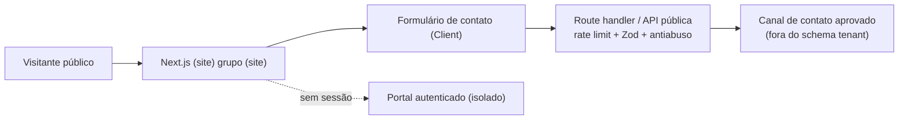

# Plano detalhado — Trilha do site institucional Althion

## Natureza e estado

O site institucional **não é uma fase numerada** do roadmap: é uma trilha de produto paralela às Fases 1–10, descrita em `docs/roadmap.md` ("Trilha do site institucional"). Ele depende de marca e conteúdo, não da ordem técnica das fases, e pode entrar em paralelo assim que suas dependências forem aprovadas.

Estado atual: existe apenas uma home pública mínima em `apps/web/src/app/page.tsx` (hero + link "Acessar plataforma"), servida pela mesma fundação Next.js do portal. Não há site institucional completo, identidade visual definida, conteúdo aprovado nem formulário público.

**Este documento é o plano. Nenhuma página nova foi implementada.** A execução está condicionada aos gates de conteúdo, marca e jurídico listados abaixo — o mesmo regime de governança das fases: nada de dado real, nada de afirmação sem lastro.

## Dependências que bloqueiam a execução

O site não deve ser construído antes de:

1. **Identidade visual aprovada** — logotipo, paleta, tipografia e tom de voz da marca Althion. Hoje o repositório tem apenas um shell neutro (`brand-mark` "A"), explicitamente descrito como "sem inventar identidade visual" no plano da Fase 1. **[MARCA A DEFINIR]**
2. **Conteúdo institucional aprovado** — texto de posicionamento, descrição de produto e provas. A visão em `docs/product/vision.md` fornece a base factual, mas a copy de marketing precisa de revisão de quem responde pela empresa. **[CONTEÚDO A APROVAR]**
3. **Base jurídica e privacidade** — política de privacidade, base legal LGPD para o formulário público, texto de consentimento, retenção e encarregado (DPO). Bloqueio externo nº 3 do `IMPLEMENTATION_PLAN.md`. **[JURÍDICO A APROVAR]**
4. **Definição do formulário público** — quais dados coletar, para onde vão e quem os opera. Sem isso, nenhum campo é criado.
5. **Domínio e hospedagem** — domínio próprio, ambiente e ownership. Bloqueio externo nº 4 (infraestrutura). **[INFRA A DEFINIR]**

Enquanto (1)–(4) não existirem, o trabalho permitido é: este plano, a arquitetura de rotas/segregação e um esqueleto de conteúdo com marcadores — sem publicar afirmações de marketing nem coletar dados reais.

## Objetivo

Apresentar a Althion publicamente e capturar interesse qualificado (clínicas e gestores), sem prometer o que o produto ainda não entrega e sem tocar no domínio clínico. A conversão principal proposta é **agendar uma conversa/diagnóstico** (lead B2B), não venda direta.

O site deve responder, nesta ordem:

1. o que é a Althion e para quem;
2. qual problema administrativo ela resolve;
3. como funciona (Radar → Score → Portal → Especialista → Recovery), de forma honesta quanto ao estágio;
4. por que confiar (governança, isolamento, sem função clínica);
5. como iniciar uma conversa.

## Público

Coerente com `docs/product/vision.md`:

- **primário:** gestor ou proprietário de clínica médica particular (dermatologia, estética médica, oftalmologia, ginecologia particular, multidisciplinar);
- **secundário:** gestor de clínica e parceiros de operação;
- **não é público desta fase:** pacientes (o site não é canal clínico nem de atendimento), odontologia complexa, e qualquer segmento sem aderência à visão.

## Escopo funcional

### 1. Site institucional (páginas públicas)

- **Home:** posicionamento, problema, pilares do produto (Radar, Score, Portal, Especialista, Recovery), diferenciação e CTA de contato;
- **Produto/Como funciona:** explicação dos pilares com honestidade de estágio (o que já existe × o que está no roadmap); nenhum número inventado de resultado;
- **Segurança e privacidade:** isolamento por tenant, decisões explicáveis, ausência de função clínica, minimização de dados — reforçando a diferenciação real;
- **Sobre/Contato:** quem é a Althion e o canal de conversa;
- **Páginas legais:** política de privacidade e termos **[JURÍDICO A APROVAR]**.

Toda afirmação segue o princípio de produto: diferenciar fato de estimativa, não apresentar projeção como resultado realizado, explicar limitações. Sem depoimentos, logotipos de clientes, prêmios ou métricas sem lastro — na ausência, usar marcadores `[PROVA A CONFIRMAR]`, nunca inventar (mesma regra da matéria de produto).

### 2. Formulário público de contato/lead

Captura de interesse comercial (B2B), **separado do formulário público do Radar** (ver item 3). Campos mínimos: nome, e-mail corporativo, clínica/organização, telefone/WhatsApp opcional, mensagem. Exigências:

- consentimento explícito com base legal e link para a política **[JURÍDICO]**;
- rate limit e antiabuso (o roadmap exige isso explicitamente para superfícies públicas);
- validação server-side (Zod), honeypot/CAPTCHA conforme decisão antiabuso;
- segregação: leads públicos **não** entram nas tabelas tenant-owned do produto sem processo aprovado; destino inicial é um canal de contato, não o schema multi-tenant.

### 3. Formulário público do Radar (opcional, trilha própria)

O roadmap prevê um formulário público do Radar. Ele tem exigências mais fortes que o formulário de contato e **só entra com fonte, base legal e antiabuso definidos**:

- rate limit, consentimento/base aplicável, antiabuso e **segregação de dados** obrigatórios;
- não pode escrever direto nas tabelas do produto autenticado sem isolamento;
- fica fora do primeiro corte do site até (3) e (4) das dependências estarem aprovados. **[ESCOPO A CONFIRMAR: incluir no site institucional ou tratar como fase própria junto da Fase 2]**

## Fora de escopo

- qualquer conteúdo, campo ou promessa clínica;
- painel autenticado, dados de clínica real ou integração Helena no site público;
- depoimentos/clientes/métricas sem autorização e lastro;
- blog/CMS, e-commerce, área de login social, app móvel;
- coleta de dados pessoais além do necessário ao contato;
- escrita direta de leads públicos no schema tenant-owned sem processo aprovado.

## Arquitetura proposta

Reutilizar a fundação Next.js **sem acoplar o site ao portal autenticado**:

- rotas públicas em um grupo próprio (ex.: `apps/web/src/app/(site)/`), isoladas do grupo autenticado `(app)`/`/cockpit`;
- o `proxy.ts`/middleware já deixa rotas públicas passarem e só protege `/app`; manter esse contrato e garantir que nenhuma rota do site exija sessão;
- Server Components para conteúdo estático; Client Components só nos formulários;
- o endpoint do formulário de contato vive na API (`apps/api`) ou como route handler dedicado, com rate limit e validação — **não** reaproveita as RPCs tenant-owned do produto;
- conteúdo versionado no repositório (ou fonte de conteúdo aprovada), sem CMS externo no primeiro corte;
- identidade visual entra como tokens/CSS próprios do site quando a marca existir, sem sobrescrever o design system do portal.

## Modelo de dados

Nenhuma tabela tenant-owned nova. Se o lead de contato precisar de persistência, criar armazenamento **segregado** (fora das tabelas do produto), com retenção e base legal próprias — decisão a tomar com o jurídico. Preferência inicial: encaminhar o contato a um canal (e-mail/CRM comercial) sem persistir PII no banco do produto. **[DESTINO DO LEAD A DEFINIR]**

## Rotas propostas

| Rota                | Entrega                                                        |
| ------------------- | ------------------------------------------------------------- |
| `/`                 | home institucional (evolui a página mínima atual)             |
| `/produto`          | pilares e como funciona, com honestidade de estágio           |
| `/seguranca`        | segurança, privacidade e ausência de função clínica           |
| `/sobre`            | quem é a Althion                                               |
| `/contato`          | formulário de contato comercial                               |
| `/privacidade`      | política de privacidade **[JURÍDICO]**                        |
| `/termos`           | termos de uso **[JURÍDICO]**                                  |
| `/radar` (opcional) | formulário público do Radar, só com governança completa       |

Todas públicas, sem sessão; o portal permanece em `/entrar`, `/app` e `/cockpit`, intocado.

## Direção visual

**A definir com a marca.** O que já existe é um shell neutro deliberadamente sem identidade. Quando a marca for aprovada, definir paleta, tipografia, grid e componentes próprios do site como tokens separados, sem quebrar o design system do portal. Até lá, o site herda o estilo neutro atual. **[DIREÇÃO VISUAL A DEFINIR]**

## SEO e mensuração

- SEO: title/description por página, H1 único, dados estruturados `Organization`, sitemap e robots; palavras-chave de gestão administrativa de clínica — **sem** termos clínicos ou promessas de resultado médico;
- mensuração: eventos de clique em CTA e envio de formulário, respeitando consentimento de cookies (opção mais privativa por padrão, conforme princípio de minimização);
- nenhuma tag de terceiros antes de decisão de privacidade. **[ANALYTICS A DEFINIR COM JURÍDICO]**

## Acessibilidade e performance

Mesmos padrões já praticados no portal: estrutura semântica, contraste AA, navegação por teclado, foco visível, `prefers-reduced-motion`, rótulos e mensagens de erro nos formulários; imagens otimizadas, fontes locais, boa pontuação Core Web Vitals. O E2E público com axe (já existente) cobre as páginas do site.

## Riscos e mitigação

| Risco                                                    | Mitigação                                                                 |
| -------------------------------------------------------- | ------------------------------------------------------------------------- |
| Copy prometer resultado sem lastro                       | princípio de produto: fato ≠ estimativa; sem número/depoimento inventado  |
| Site sugerir função clínica                              | linguagem administrativa; página de segurança reforça a ausência clínica  |
| Formulário público sem base legal virar risco LGPD       | bloquear execução até jurídico aprovar consentimento e retenção           |
| Lead público contaminar schema tenant                    | segregação: destino fora das tabelas do produto                           |
| Abuso do formulário público                              | rate limit, antiabuso, validação server-side                             |
| Acoplar site ao portal e vazar sessão/estado             | grupo de rotas isolado, sem sessão, middleware protegendo só `/app`       |
| Publicar identidade "de template" antes da marca real    | herdar shell neutro até a marca ser aprovada                              |
| Analytics de terceiros antes da decisão de privacidade   | nenhuma tag antes do gate jurídico                                        |

## Estratégia de testes

- unit/component: validação do formulário (Zod), estados de erro e sucesso;
- integração: endpoint público com rate limit, rejeição sem consentimento, sanitização;
- E2E + axe: navegação das páginas públicas, envio do formulário, teclado e contraste;
- verificação de que nenhuma rota do site exige sessão e de que o portal continua protegido;
- confirmação de que nenhum lead público é escrito no schema tenant-owned.

## Critérios de aceite

- páginas públicas no ar sem exigir sessão, com o portal isolado e protegido;
- nenhuma afirmação de marketing sem lastro; ausência de função clínica explícita;
- formulário de contato com consentimento, rate limit, antiabuso e destino segregado;
- SEO, acessibilidade e performance nos padrões do portal;
- lint, typecheck, testes, build e E2E público verdes;
- identidade visual aplicada só após aprovação da marca;
- pendências de marca, conteúdo, jurídico e infra resolvidas antes da publicação real.

## Ordem de execução (quando desbloqueado)

1. aprovar marca, conteúdo, base jurídica e destino do lead;
2. estruturar o grupo de rotas públicas isolado, sem acoplar ao portal;
3. montar páginas com conteúdo aprovado (sem prova inventada);
4. implementar o formulário de contato com governança (rate limit, consentimento, segregação);
5. aplicar identidade visual e SEO;
6. rodar gates, acessibilidade e revisão de privacidade;
7. avaliar, separadamente, o formulário público do Radar (fonte, base legal, antiabuso) — possivelmente como trilha própria junto da Fase 2.

## Pendências a confirmar

- **Marca:** logotipo, paleta, tipografia, tom de voz.
- **Conteúdo:** copy institucional aprovada; o que exibir como "já disponível" × "no roadmap".
- **Jurídico:** política de privacidade, base legal do formulário, texto de consentimento, retenção, DPO, decisão sobre analytics.
- **Prova social:** há clientes/depoimentos/números autorizados? Se não, permanecem como marcadores.
- **Lead:** destino (e-mail, CRM comercial, storage segregado) e responsável pela operação.
- **Radar público:** entra no site institucional ou vira trilha própria junto da Fase 2?
- **Infra:** domínio, hospedagem e ambiente do site (compartilha deploy do portal ou separado?).
- **Conversão:** "agendar diagnóstico/conversa" é a ação principal aprovada?
